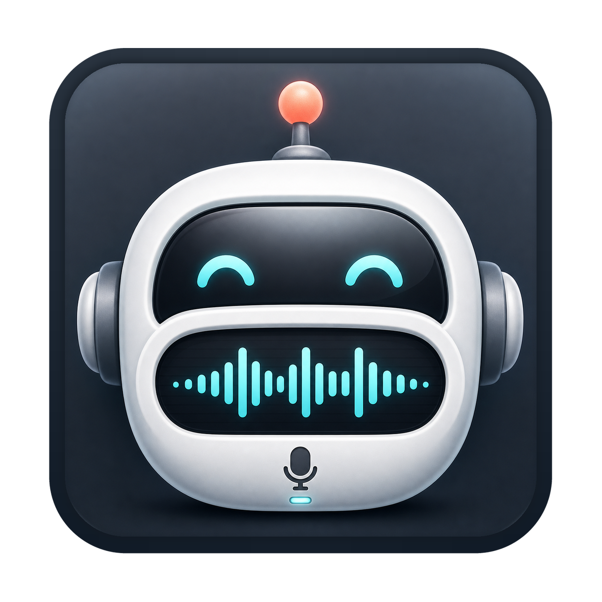
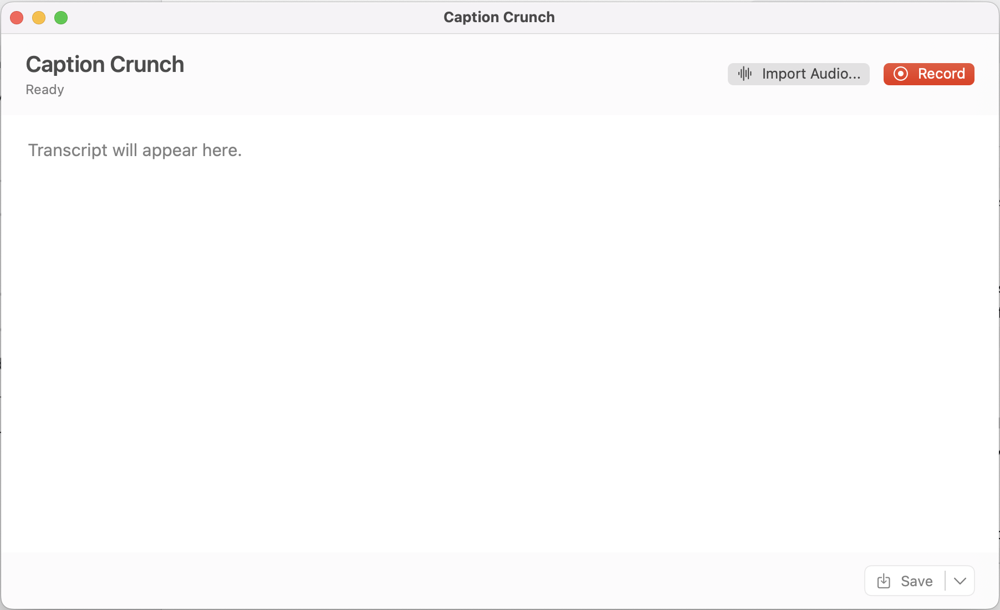
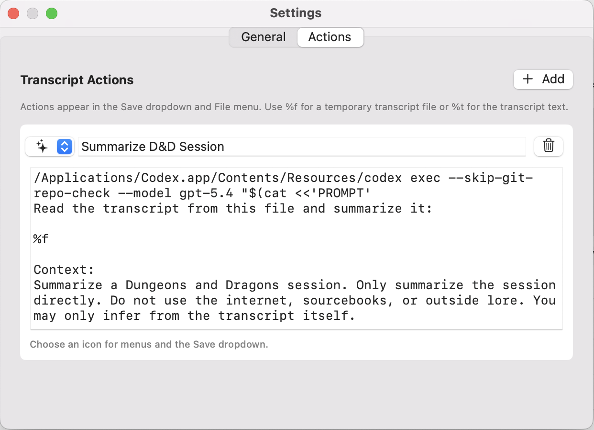

<table>
  <tr>
    <td width="132" valign="top">
      
    </td>
    <td valign="top">
      <h1>Caption Crunch</h1>
      <p><strong>Live captions and transcripts for macOS.</strong></p>
      <p>
        <a href="../../actions/workflows/ci.yml"></a>
        <a href="../../actions/workflows/release.yml"></a>
      </p>
    </td>
  </tr>
</table>

Caption Crunch is a small native Mac app that turns speech from a chosen input device into live, readable captions. It is built for tabletop games, calls, streams, interviews, accessibility experiments, and any moment where you want a local caption window without opening a full meeting app.

Caption Crunch is local-first: transcripts stay on your Mac, the app does not upload your audio or text to a cloud service, and normal recording/import transcription does not require an internet connection.

[Download the latest DMG](../../releases/latest/download/CaptionCrunch-0.1.0.dmg)  
[View all releases](../../releases)



## Why Use It?

- **Caption speech live.** Pick a Mac input device, press Record, and watch the transcript appear as people talk.
- **Import existing audio or video.** Drop in common media files and Caption Crunch transcribes the audio track.
- **Keep the transcript readable.** Pause detection adds paragraph breaks, and the transcript auto-scrolls smoothly while new text arrives.
- **Save or reuse the result.** Save plain text transcripts, copy the full log, or run custom commands against the transcript.
- **Stay out of the way.** When minimized, Caption Crunch can show transparent on-screen captions at the edge of your display (experimental)
- **Keep it local.** Audio and transcript text remain on your machine unless you explicitly run a custom action that sends them somewhere.

## What It Does

Caption Crunch uses macOS audio capture and Apple Speech recognition. Everything is designed around a simple transcript-first workflow:

1. Choose an input in `Caption Crunch > Settings`.
2. Press `Record` to start live transcription.
3. Use `Pause` or `Stop` while recording.
4. Save the transcript as plain text, or run a custom transcript action.

For existing recordings, use `Import Audio...` to transcribe common audio and video formats. Video imports automatically extract the audio track first when possible.

If you want to caption audio from another Mac app in real time, route that app into a virtual input device and select it in Caption Crunch. [Loopback by Rogue Amoeba](https://www.rogueamoeba.com/loopback/) is recommended for this kind of app-to-input routing.

## Transcript Actions

Caption Crunch can also run your own background commands against the current transcript. This makes it useful for AI summaries, cleanup scripts, publishing workflows, or anything else you can express as a command.

Add actions in `Caption Crunch > Settings > Actions`. Each action has:

- **Name:** shown in the Save dropdown and File menu.
- **SF Symbol:** optional button/menu icon, such as `sparkles`, `wand.and.stars`, `doc.text`, or `text.quote`.
- **Command:** the background command to run.

Placeholders:

- `%f` writes the transcript to a temporary text file and substitutes the shell-quoted file path.
- `%t` substitutes the shell-quoted transcript text directly.
- `%a` substitutes the shell-quoted audio file path. For recordings, Caption Crunch creates a temporary audio file. For imports, it uses the imported media file.

When the command finishes, Caption Crunch opens a result window with copyable output and a Save button.



## Features

- Native SwiftUI/AppKit macOS app
- Input-device picker in Settings
- Live transcription from the selected input
- Import common audio and video files for transcription
- Record, Pause, Resume, and Stop controls
- Read-only transcript view that stays copyable/selectable
- Auto-scrolling transcript without jostling on partial recognition updates
- Pause-based paragraph breaks for readability
- Plain-text transcript export
- Custom transcript actions that run background commands and show captured output
- Optional transparent caption overlay when minimized
- Animated Dock icon waveform while recording or importing
- GitHub Actions CI and tagged-release DMG publishing

## Requirements

- macOS 13 or newer
- Apple Speech recognition availability for your locale
- No internet connection is required for the app's built-in transcription workflow.

On first use, macOS asks for microphone and speech recognition permissions. Development rebuilds can make macOS ask again because ad-hoc app signatures change.

## Notes

- Apple's Speech framework does not expose reliable live speaker diarization on macOS, so speaker changes are approximated when they include an audible pause.
- The app periodically rolls the Apple Speech streaming task so longer recording sessions continue transcribing instead of ending when the framework times out.
- Custom transcript actions run locally through the shell, but those commands can do anything your shell can do, including making network requests. Only add commands you trust.

---

## Developer Setup

Caption Crunch intentionally avoids requiring an Xcode project. It builds with the macOS command line tools.

Developer requirements:

- Xcode Command Line Tools or Xcode
- macOS 13 SDK or newer

### Build Locally

```sh
./build.sh
```

The built app is written to:

```sh
build/Caption Crunch.app
```

Run it with:

```sh
open "build/Caption Crunch.app"
```

### Test Locally

```sh
./scripts/test.sh
```

The test script performs the same practical checks used in CI:

- shell syntax checks
- plist validation
- transcript formatting unit tests
- minimized-overlay snippet unit tests
- recoverable speech-error unit tests
- menu regression checks for removed View/Window/editing items
- source icon transparency and outer-corner fringe checks
- app build
- icon presence and alpha check
- icon extraction sanity check
- ad-hoc code-signature verification

### Build a DMG

```sh
./scripts/build_dmg.sh
```

The DMG is written to `dist/`. It contains `Caption Crunch.app` and an `Applications` shortcut so installation is the usual drag-to-Applications flow.

### GitHub Automation

This repo includes two GitHub Actions workflows:

- `.github/workflows/ci.yml`  
  Runs on pushes and pull requests. It builds the app and runs `./scripts/test.sh`.

- `.github/workflows/release.yml`  
  Runs when a tag matching `v*` is pushed. It builds and tests the app, creates a DMG, and publishes a GitHub Release with the DMG attached.

To publish a release:

```sh
git tag v0.1.0
git push origin v0.1.0
```

GitHub will create the release entry and upload a downloadable DMG automatically.

## Repository Hygiene

Generated build outputs, DMGs, module caches, local environment files, and common AI-tool scratch folders are ignored in `.gitignore`.

## License

Caption Crunch is source-available, not open source. You may use it personally and contribute changes back to the original project, but redistribution, commercial use, and competing forks are not permitted without written permission. See [LICENSE](LICENSE).
